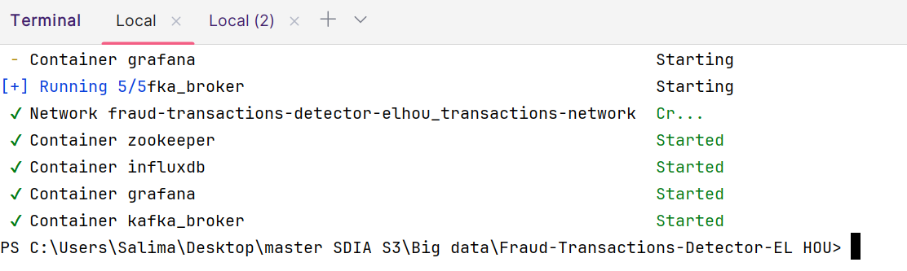
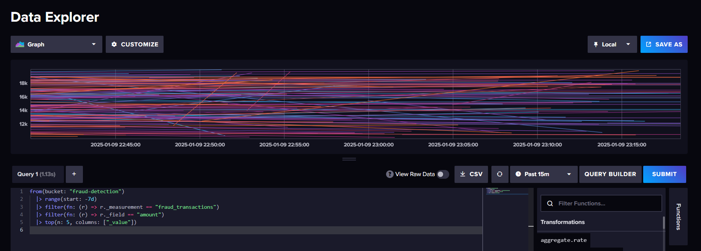

# EL HOU Salima SDIA 2

# Projet Kafka Streams pour la détection de fraudes financières en temps réel

## Description

Ce projet implémente une application Kafka Streams pour détecter des transactions financières suspectes en temps réel. Les transactions sont lues depuis un topic Kafka, les règles de détection de fraudes sont appliquées et les résultats sont envoyés vers un autre topic Kafka. Les transactions suspectes sont ensuite stockées dans une base de données InfluxDB et un tableau de bord Grafana affiche les données en temps réel.

## Architecture

L'architecture du système est la suivante :

- **Kafka Streams** pour le traitement en temps réel des flux de transactions.
- **InfluxDB** pour stocker les transactions suspectes.
- **Grafana** pour visualiser les transactions suspectes sur un tableau de bord en temps réel.
- **Docker Compose** pour déployer tous les services (Kafka, InfluxDB, Grafana) dans des conteneurs.



## *******************************************************************


## Fonctionnalités

### 1. **Lecture des transactions :** Les transactions sont lues depuis le topic `transactions-input` avec un format JSON :
    ```json
    {
      "userId": "12345",
      "amount": 15000,
      "timestamp": "2024-12-04T15:00:00Z"
    }
    ```


### 2. **Détection de fraudes :** Une règle simple est appliquée pour détecter les transactions suspectes (montant supérieur à 10 000).


### 3. **Pipeline Kafka Streams :**
 - Topic `transactions-input` : Contient les transactions brutes.
 - Topic `fraud-alerts` : Publie les transactions suspectes après application des règles.


## *******************************************************************


## *******************************************************************


## *******************************************************************


### 4. **Stockage des transactions suspectes :** Les transactions suspectes sont stockées en temps réel dans InfluxDB via Kafka Streams.


## *******************************************************************


## *******************************************************************



### 5. **Tableau de bord Grafana :** Un tableau de bord Grafana affiche :

   

 - **Résultats :**
     - Exemple de Visualisation
     - Graphique en série temporelle : Affiche les montants des transactions brutes au fil du temps

     - ## **Récupération des montants des transactions frauduleuses sur les 24 dernières heures**
   
   
     - ## **Analyse des transactions frauduleuses avec un montant supérieur ou égal à 1000 sur les 30 dernières minutes**
     

     - ## **Moyenne des montants des transactions frauduleuses par période de temps spécifiée**
   

     - ## **Analyse des transactions frauduleuses sur les dernières 24 heures**
   

## Prérequis

- Kafka
- InfluxDB
- Grafana
- Docker
- Docker Compose


